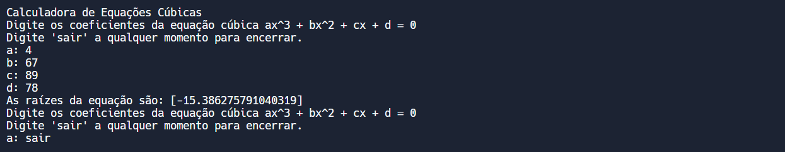

# EQUACOES CUBICAS
👨‍🏫CALCULADORA PARA RESOLVER EQUAÇÕES CÚBICAS (EQUAÇÕES DE TERCEIRO GRAU) EM SWIFT.

 <br>

## DESCRIÇÃO:
Este projeto é uma calculadora para resolver equações cúbicas (equações de terceiro grau) em Swift. A calculadora permite que o usuário insira os coeficientes da equação e calcula as raízes da equação cúbica, garantindo que as entradas fornecidas sejam números válidos.

## FUNCIONALIDADES:
1. **Resolução de Equações Cúbicas**:
   - Resolve equações cúbicas da forma \( ax^3 + bx^2 + cx + d = 0 \).
   - Calcula e exibe as raízes da equação.

2. **Validação de Entrada**:
   - Verifica se as entradas fornecidas pelo usuário são números válidos.
   - Solicita a entrada novamente se uma entrada inválida for fornecida.

3. **Interatividade**:
   - Oferece um menu interativo onde o usuário pode inserir os coeficientes da equação cúbica.
   - Permite ao usuário encerrar o programa digitando "sair".

## COMO USAR?
1. **Execução do Programa**:
   - Abra o terminal.
   - Navegue até o diretório `./CODIGO`.
   - Execute o comando:
   ```sh
   swift main.swift
   ```

2. **Menu de Entrada**:
   - Ao iniciar o programa, uma mensagem de boas-vindas é exibida.
   - O programa solicita ao usuário que insira os coeficientes da equação cúbica (a, b, c, d).
   - Se o usuário deseja encerrar o programa, pode digitar "sair" a qualquer momento.

3. **Entrada de Dados**:
   - As entradas são validadas para garantir que sejam números válidos.
   - Se uma entrada inválida for fornecida, o programa exibirá uma mensagem de erro e solicitará a entrada novamente.

4. **Cálculo e Resultado**:
   - O programa calcula as raízes da equação cúbica e exibe o resultado no console.

5. **Repetição ou Encerramento**:
   - Após exibir o resultado, o programa solicita novamente os coeficientes da equação, permitindo ao usuário resolver novas equações.
   - O usuário pode encerrar o programa a qualquer momento digitando "sair".

## NÃO SABE?
- Entendemos que para manipular arquivos em muitas linguagens e tecnologias, é necessário possuir conhecimento nessas áreas. Para auxiliar nesse aprendizado, oferecemos cursos gratuitos disponíveis:
* [CURSO DE SWIFT](https://github.com/VILHALVA/CURSO-DE-SWIFT)
* [CONFIRA MAIS CURSOS](https://github.com/VILHALVA?tab=repositories&q=+topic:CURSO)

## CREDITOS:
- [PROJETO CRIADO PELO VILHALVA](https://github.com/VILHALVA)


